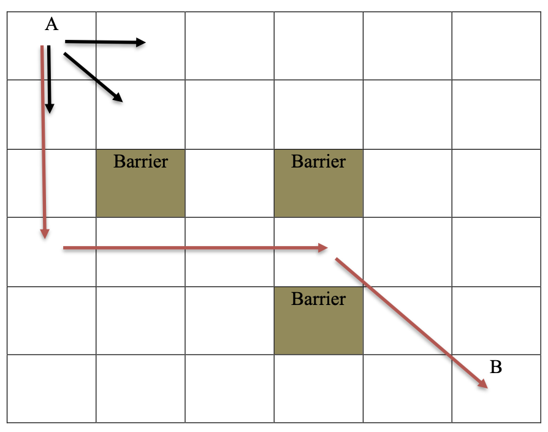
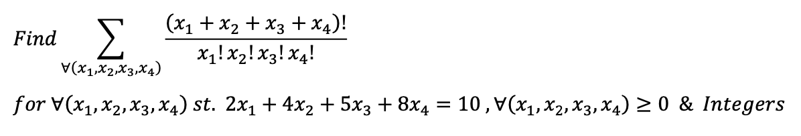

# Dynamic Programming
Some applications of Dynamic Programming in Python

# Problem 1:

Consider the following 6x6 grid:





A mover wants to travel from point A to point B. During this journey, the mover can always move in three directions: down, diagonal, and right. Additionally, there is no restriction on the number of cells traversed in each direction. For example, in the first move, the mover can move from 1 to 5 cells downward. Along the path, there are obstacles that the mover must avoid. An example of the distance traveled by the mover is indicated in red.

Using dynamic programming, we determine the total number of possible paths that the mover can take from point A to point B.

For doing so, we first model the given problem with a grid as below:


```python
Grid = [[0, 0, 0, 0, 0, 0],
        [0, 0, 0, 0, 0, 0],
        [0, 1, 0, 1, 0, 0],
        [0, 0, 0, 0, 0, 0],
        [0, 0, 0, 1, 0, 0],
        [0, 0, 0, 0, 0, 0]]
```


As it can be seen, we have a 6x6 grid, where we have obstacles in the states with coordinates (2,1), (2,3), and (4,3) which are shown with number 1.

We used a top-down approach for implementing the Dynamic Programming algorithm. The model is implemented by using recursion, since the num of ways to reach cell (i,j) is the sum of the number of ways to reach cells (i-1,j), (i,j-1) and (i-1, j-1). The algorithm checks when we reach the maximum row or column, and therefore can't move any further, and when we reach the objective cell.
The only important thing is to notice if any of the cells are obstacles, and limit our movements.


```python
def UniquePaths(i, j, num_rows, num_columns, Grid, paths):
    if (i == num_rows or j == num_columns):
        return 0

    if (Grid[i][j] == 1):
        return 0
        
    if (i == num_rows - 1 and j == num_columns - 1):
        return 1
 
    if (paths[i][j] != -1):
        return paths[i][j]
 
    paths[i][j] = UniquePaths(i + 1, j, num_rows, num_columns, Grid, paths) + UniquePaths(i, j + 1, num_rows, num_columns, Grid, paths) + UniquePaths(i + 1, j + 1, num_rows, num_columns, Grid, paths)

    return paths[i][j]
```

We initialize the paths array, and number of rows and columns, and running the recursive function. The result is as below:


```
Number of ways to reach state B, starting from state A =  318
```


# Problem 2:

Solving the following problem using dynamic programming:



Another way of looking at this problem is as a permutation problem, and looking the summation as a recursive problem.


For modeling the algorithm as a dynamic programming model, the bottom-up approach is to build a memorization table dp[i][j], where each cell is the solution to the
2x1 + 4x2 + 5x3 + 8x4 = i, using the first j variables x1, x2, ..., xj. For making the codes simpler, we used top-down approach by making the algorithm recursive as below:

```python
def solve_equation(coefficients,num_integers,summation, i, j):
    if i == num_integers:
        return factorial(num_integers)/(factorial(num_integers-j)*factorial(j))
    
    if j == summation:
        return 0
    result = 0
    for k in range(num_integers//coefficients[j]+1):
        result += solve_equation(coefficients, num_integers - k*coefficients[j], summation, i+1, j+1)
    return result
```


Initializing the coefficients and constraint equation as given in the question:


```python
num_integers=10
summation = 4
coefficients = [2,4,5,8]
```


The result is as below:

```
results = 11.0
```
